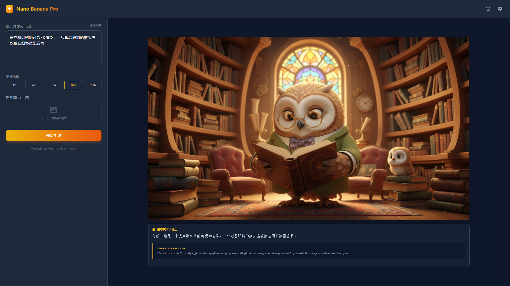

# 🍌 Google Nano Banana Pro

<div align="center">

   

**一个轻量、现代且隐私优先的 Google Gemini 图像生成 Web 客户端**

[功能特性](#-功能特性) • [快速开始](#-快速开始) • [界面预览](#-界面预览) • [配置说明](#-配置说明)

</div>

---

## 📖 简介

**Google Nano Banana Pro** 是一个基于 Python Flask 和 Tailwind CSS 构建的 Web 应用程序，专为调用 Google Gemini 系列模型（如 `gemini-2.5-flash-image`, `gemini-3-pro-image-preview`）而设计。

它提供了一个**无状态**、**隐私优先**的现代化界面，让你能轻松体验 Google 最新的图像生成能力。所有的敏感配置（API Key）和生成历史都直接存储在你的浏览器本地，后端仅作为纯粹的 API 转发代理。

> 作者寄语：配合 DMXAPI 的低价API食用更佳哦！

## ✨ 功能特性

| 功能 | 说明 |
| :--- | :--- |
| 🔒 **隐私优先** | **零服务端存储**。API Key、Base URL 和生成历史仅保存在您的浏览器（LocalStorage/IndexedDB）。 |
| 🎨 **多模式支持** | 支持 **文生图 (Text-to-Image)** 和 **图生图 (Image-to-Image)**。 |
| 📐 **灵活控制** | 支持自定义图片比例（1:1, 16:9, 4:3, 3:4, 9:16）和模型选择。 |
| 🖼️ **本地历史** | 内置历史记录管理器，支持回溯查看、重新下载生成的图片。 |
| ⚡ **实时反馈** | 实时上传预览、生成进度提示、错误信息可视化展示。 |
| 🌙 **现代 UI** | 基于 Tailwind CSS 精心设计的深色模式界面，美观且实用。 |

## 🚀 快速开始

只需三步即可运行：

### 1. 环境准备
确保已安装 Python 3.8+。克隆项目并安装依赖：

```bash
# 安装依赖
pip install -r requirements.txt
```

### 2. 启动服务

```bash
python app.py
```

### 3. 访问应用
打开浏览器访问：[http://127.0.0.1:5000](http://127.0.0.1:5000)

---

## ⚙️ 配置说明

应用启动后，首次使用需要配置 API 信息。这些信息**只保存在你的浏览器**中。

1.  点击页面右上角的 **设置图标 (⚙️)**。
2.  **API Key**: 输入你的 Google Gemini API Key。
3.  **Base URL** (可选): 如果你在国内或需要使用代理，请输入反代地址（例如 `https://generativelanguage.googleapis.com` 或自定义域名）。
4.  **Model Name**: 默认为 `gemini-2.5-flash-image`，可根据需要修改。
5.  点击 **保存** 即可生效。

---

## 📸 界面预览

### 主界面


---

## �️ 技术栈

*   **Backend**: Python, Flask, Google GenAI SDK
*   **Frontend**: HTML5, Tailwind CSS (CDN), JavaScript (ES6+)
*   **Storage**: LocalStorage (配置), IndexedDB (历史记录)

## 📄 许可证

本项目采用 [MIT License](LICENSE) 开源。
